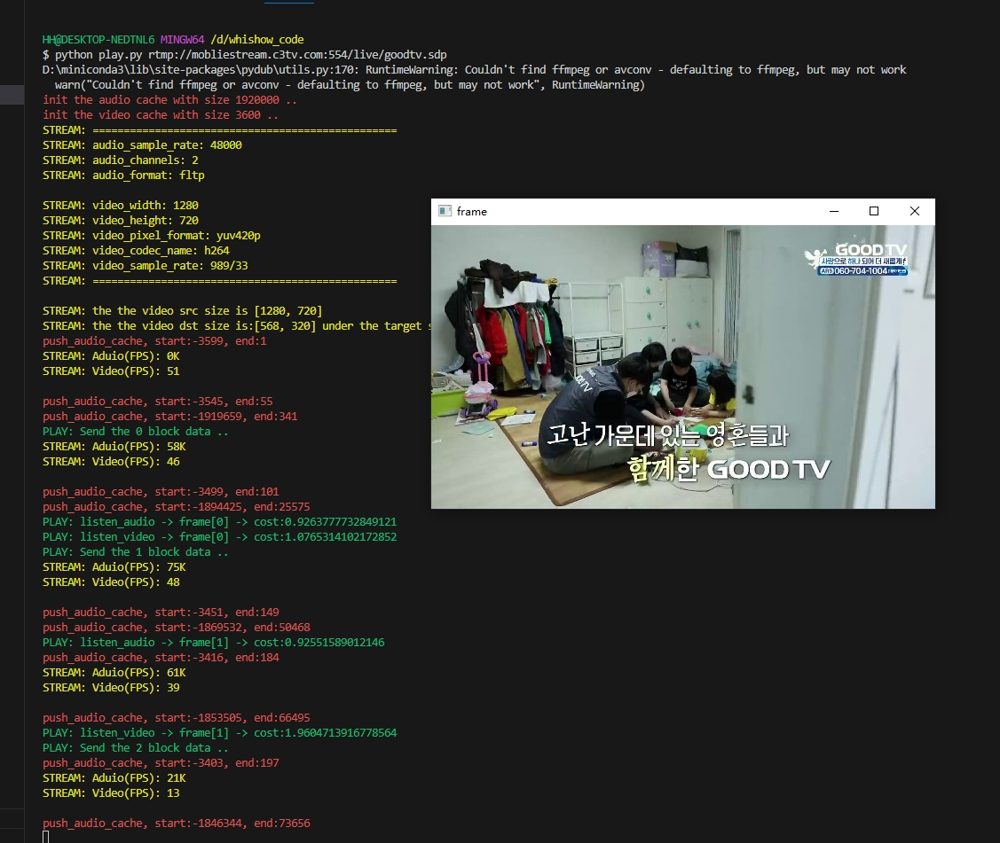

# Whishow

#### Whistream是基于Whisper后端的的流式语音识别工具，支持rtsp/rtmp/mp4等视频流在线语音识别

## 1. 介绍
#### Whishow是实时播放帧级别音频流和视频流的工具，支持rtsp/rtmp/mp4等输入
下载地址： https://github.com/coolEphemeroptera/Whishow/releases/download/v1.0.0/whishow.exe

## 2. 使用

./whishow.exe <video path>

  例如：
  
  离线文件 ./whishow.exe test.mp4
  
  在线流 ./whishow.exe rtmp://mobliestream.c3tv.com:554/live/goodtv.sdp

## 3. 联系我们
605686962@qq.com
coolEphemeroptera@gmail.com

